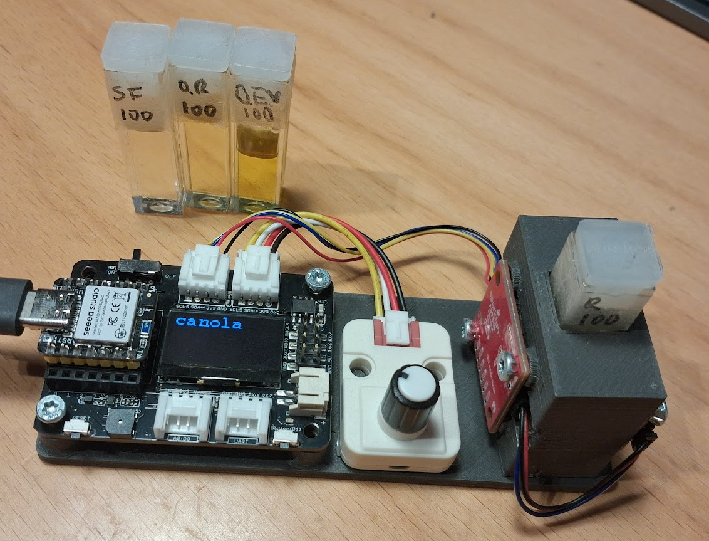
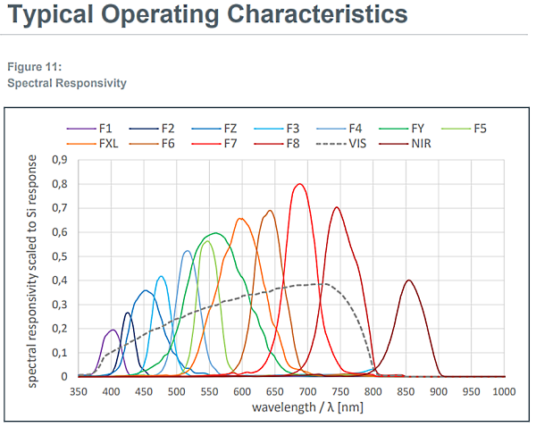

# Simple spectrometer for edible oils

This is a simple setup for a basic 14 channel visible-spectrum
sensor based on [ams OSRAM AS7343](https://ams-osram.com/products/sensor-solutions/ambient-light-color-spectral-proximity-sensors/ams-as7343-spectral-sensor),
using [MicroPython](https://micropython.org/) firmware.



The device has a stand designed for standard (10 mm) cuvettes,
set up for flouresence spectrocopy using white LED and reflectance spectroscopy using white LED.

Initially intended for characterization of edible oils,
such as olive oil, canola/rapeseed, sunflower, et.c.

This can be used for things like:

- Detect/classify the type of oil
- Detect adulterated oils, for example addition of waste frying oil or other oils in virgin olive oil
- Detect degraded oil quality, for example due to exessive oxygen/heat exposure or age

The machine learning parts are powered by [emlearn-micropython](https://github.com/emlearn/emlearn-micropython),
a machine learning and digital signal processing library for MicroPython.

## Status
*Proof of Concept*. 

Can collect data from AS7343, and classify the type pf edible successfully using a nearest-neighbor model.
For the demo only 2 dimensions were used, but up to 2x12=24 dimensions can be used.

## TODO

- Speed up the measurement cycle. Want under 1 second total
- Collect data on different concentrations of oil. 
- Test ability to detect adulteration of extra virgin olive oil
- Implement regression model to estimate concentrations. Example: PCA+linreg, or PLSR

## Operating principle

The device measures the samples under 2 conditions:

- When exposed to white light from same side as sensor (reflectance)
- When exposed to 400 nm UV light from the side (floursence)

Many edible oils have a
Extra Virgin Olive Oil (EVOO) notably has a red-ish response under UV,
which comes from the chlorophyll. This is not present in refined olive oil.


The AS7343 has 12 narrow-band channels across the visible spectrum and near-infrared (NIR),
plus 2 broad-band channels.



## Hardware

Below is the parts that I have used.
The AS7343 chip is critical, and a microcontroller that can run MicroPython.
If you are willing to adapt the firmware code the other parts can be replaced
with other alternatives relatively easily.

#### Electronics

- [SparkFun Spectral Sensor - AS7343 (Qwiic)](https://www.sparkfun.com/sparkfun-spectral-sensor-as7343-qwiic.html)
- [Seeed Studio XIAO NRF52840](https://www.seeedstudio.com/Seeed-XIAO-BLE-nRF52840-p-5201.html). Optional: Sense variant
- [Adafruit AW9523 GPIO Expander and LED Driver Breakout - STEMMA QT / Qwiic](https://www.adafruit.com/product/4886)
- [Seeed Studio Expansion Board Base for XIAO](https://www.seeedstudio.com/Seeeduino-XIAO-Expansion-board-p-4746.html)
- [M5Stack Unit Encoder - I2C with Grove connector](https://docs.m5stack.com/en/unit/encoder)
- 400 nm UV LED, 5mm
- 1x Grove to Qwiic / Stemma QT adapter cable
- 1x Qwiic / Stemma QT cable
- 1x Grove cable (NOTE: often included with Grove devices)

All should be available from Digikey.

#### Mechanics

- 10 mm light-path cuvettes (12.5x12.5x45 mm / 4.5 ml)
- M3 wood/plastic screws

#### 3d-printed parts

- Base board for XIAO. [STEP]() | [FreeCAD]()
- Cuvette holder. [STEP]() | [FreeCAD]()

## Firmware

#### Install MicroPython

For the XIAO NRF52840 I used the Zephyr port of MicroPython.
As of November 2025 it is not downloadable on micropython.org, but must be built.


#### Install dependencies

External dependencies
```
mpremote mip install os-path
```

Local files
```
mpremote cp -r firmware/ :
```

Run 
```
mpremote run firmware/spectrometer_main.py
```

